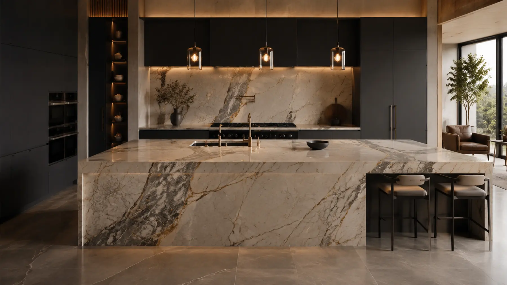

<div align="center">

# Marmoraria Santa Maria

### Pedra natural. Precisão humana.

Site institucional moderno e responsivo para uma marmoraria, com experiência visual premium, efeito parallax e foco em conversão pelo WhatsApp.

[](https://nextjs.org/)
[](https://react.dev/)
[](https://www.typescriptlang.org/)
[](https://tailwindcss.com/)

[Ver demonstração](https://marmoraria-santa-maria.gabrielpaizante.chatgpt.site) · [Reportar problema](https://github.com/Yauim/marmoraria-santa-maria/issues)

</div>

---



## Sobre o projeto

A **Marmoraria Santa Maria** é uma landing page desenvolvida para apresentar serviços, materiais e diferenciais de uma empresa especializada em mármore, granito, quartzo e quartzito.

O projeto combina uma identidade visual inspirada em pedras naturais com navegação simples, responsividade e chamadas claras para solicitação de orçamento.

> **Observação:** o telefone, o WhatsApp e o e-mail presentes no projeto são provisórios e devem ser substituídos pelos dados reais antes do uso comercial.

## Principais recursos

- Layout responsivo para celular, tablet e computador
- Navegação fixa com menu lateral acessível no celular
- Efeito parallax otimizado com `requestAnimationFrame`
- Renderização do parallax apenas em elementos visíveis
- Respeito à preferência `prefers-reduced-motion`
- Imagens convertidas para WebP
- Botão de orçamento integrado ao WhatsApp
- Rolagem suave e botão funcional para voltar ao topo
- Metadados de SEO e idioma configurados para português do Brasil
- Componentes acessíveis com Shadcn UI
- Código tipado com TypeScript

## Tecnologias

| Tecnologia | Utilização |
| --- | --- |
| Next.js 16 | Estrutura, renderização e metadados |
| React 19 | Componentização da interface |
| TypeScript | Tipagem e segurança no desenvolvimento |
| Tailwind CSS 4 | Base de estilos e design system |
| Shadcn UI | Botões e menu lateral acessível |
| Lucide React | Ícones da interface |
| CSS moderno | Responsividade, animações e identidade visual |

## Estrutura principal

```text
app/
├── globals.css                 # Design, responsividade e animações
├── layout.tsx                  # Metadados e estrutura global
└── page.tsx                    # Conteúdo da página

components/
├── back-to-top-button.tsx      # Botão de retorno ao início
├── parallax-engine.tsx         # Motor de parallax performático
├── site-header.tsx             # Cabeçalho e menu responsivo
└── ui/                         # Componentes Shadcn UI

public/
└── images/                     # Imagens WebP do projeto
```

## Como executar localmente

### Pré-requisitos

- [Node.js](https://nodejs.org/) 22.13 ou superior
- npm

### Instalação

```bash
git clone https://github.com/Yauim/marmoraria-santa-maria.git
cd marmoraria-santa-maria
npm install
npm run dev
```

Abra o endereço exibido no terminal para visualizar o projeto.

### Build de produção

```bash
npm run build
```

## Personalização

Os principais dados podem ser alterados nestes arquivos:

| Informação | Arquivo |
| --- | --- |
| Textos, telefone, e-mail e WhatsApp | `app/page.tsx` |
| Cores, espaçamento e responsividade | `app/globals.css` |
| Menu e identidade do cabeçalho | `components/site-header.tsx` |
| Intensidade do parallax | `components/parallax-engine.tsx` e `app/page.tsx` |
| Título, descrição e SEO | `app/layout.tsx` |
| Imagens | `public/images/` |

## Acessibilidade e desempenho

- Links e controles com nomes acessíveis
- Link para pular diretamente ao conteúdo
- Estados de foco visíveis para navegação por teclado
- Animações reduzidas quando solicitado pelo sistema operacional
- Eventos de rolagem passivos e atualização sincronizada com o navegador
- Imagens leves para carregamento mais rápido

## Autor

Desenvolvido por **Gabriel Paizante**.

[](https://github.com/Yauim)
[](https://www.linkedin.com/in/gabriel-paizante/)

---

<div align="center">
  Feito com Next.js, TypeScript e atenção aos detalhes.
</div>
